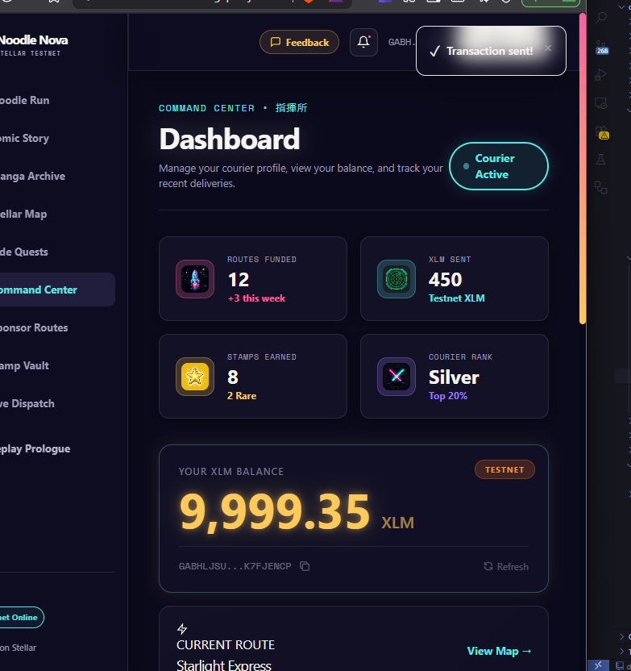
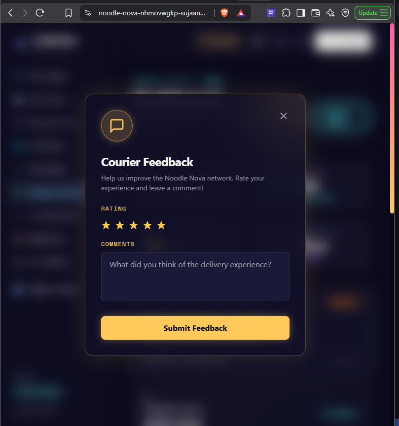
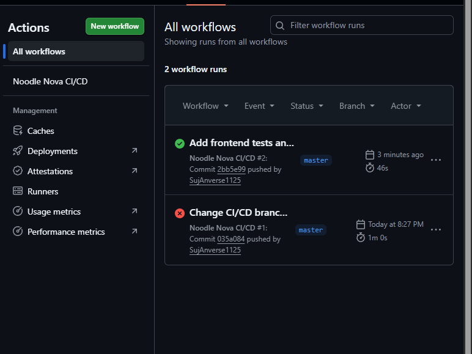
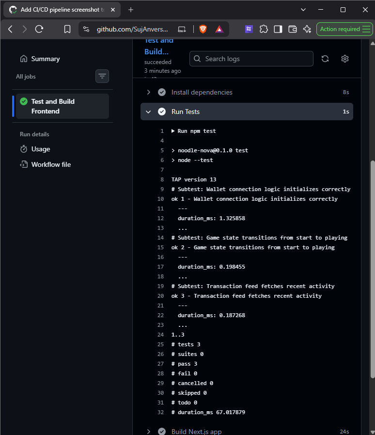
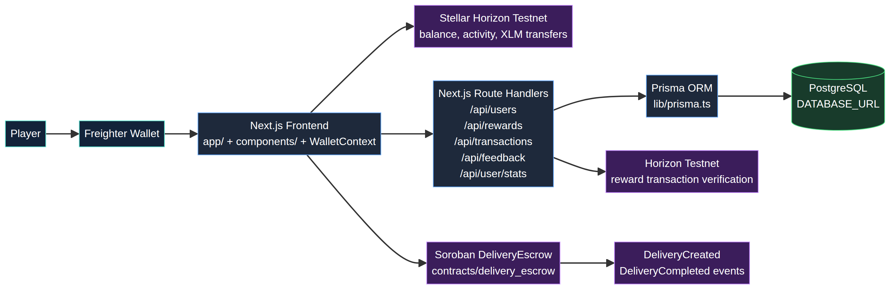

# Noodle Nova

**Live Demo:** [https://noodle-nova-seven.vercel.app/](https://noodle-nova-seven.vercel.app/)  
**Demo Video:** [Watch on Google Drive](https://drive.google.com/file/d/1N6QC__iKYQbef9ZXsaxMIjnC2TDsDUwN/view?usp=drive_link)

Noodle Nova is a **Stellar Testnet dApp** built around a gamified ramen-delivery experience. Users can connect a Freighter wallet, view Testnet XLM balance and recent activity, send Testnet XLM, and interact with a Soroban delivery-escrow contract that locks funds until a sponsored delivery is completed.

> **Testnet only:** Do not use real funds or production credentials.

## Links

| Resource | Link |
| --- | --- |
| Live demo | [noodle-nova-seven.vercel.app](https://noodle-nova-seven.vercel.app/) |
| Demo video | [Google Drive Demo Video](https://drive.google.com/file/d/1N6QC__iKYQbef9ZXsaxMIjnC2TDsDUwN/view?usp=drive_link) |
| Public repository | [SujAnverse1125/NoodleNova](https://github.com/SujAnverse1125/NoodleNova) |
| CI verification | [`submission/ci-status-level5.md`](submission/ci-status-level5.md) · [successful workflow run](https://github.com/SujAnverse1125/NoodleNova/actions) |
| Feedback-to-improvement traceability | [`submission/feedback-to-improvements.md`](submission/feedback-to-improvements.md) |
| User/activity evidence register | [`submission/level5-user-activity.md`](submission/level5-user-activity.md) |
| Public feedback export | [`submission/noodle-nova-feedback-export.xlsx`](submission/noodle-nova-feedback-export.xlsx) |
| Feedback form | [Noodle Nova Feedback Form](https://docs.google.com/forms/d/e/1FAIpQLSffUAkxXeMcoz_oSjOj7lhrEIu95R5Odv4-0iUxKnE_TctYuA/viewform) |
| Response sheet | [Noodle Nova response sheet](https://docs.google.com/spreadsheets/d/1i4tkHd1MR0qPSeLngOxr9hNsqelM31TxBhXPZilFecI/edit?usp=sharing) |
| Walkthrough video | [`Download the Level 5 walkthrough`](submission/noodle-nova-level5-walkthrough.mp4) |
| Pitch deck/PPT link | [Level 5 Pitch Deck](https://1drv.ms/p/c/02c700637cf1bf4f/IQDxKvQ777MLTJY1k8-QM07GASO1z2yG7NYwWpfID7nuhoA?e=X42qG5g) |

### Implementation Links

| Improvement | Evidence | Commit |
| --- | --- | --- |
| First-flight onboarding checklist and landing-page How it works guide | [`feedback-to-improvements.md`](submission/feedback-to-improvements.md) | [`cdc89e0`](https://github.com/SujAnverse1125/NoodleNova/commit/cdc89e0) |
| Pending, confirmed, error, retry, and Stellar Expert receipt states | [`feedback-to-improvements.md`](submission/feedback-to-improvements.md) | [`cdc89e0`](https://github.com/SujAnverse1125/NoodleNova/commit/cdc89e0) |
| Wallet registration and feedback validation improvements | [`level5-release-notes.md`](submission/level5-release-notes.md) | [`cdc89e0`](https://github.com/SujAnverse1125/NoodleNova/commit/cdc89e0) |
| Privacy-safe lifecycle analytics events and scoped CI tests | [`analytics-evidence.md`](submission/analytics-evidence.md) and [`level5-release-notes.md`](submission/level5-release-notes.md) | [`cdc89e0`](https://github.com/SujAnverse1125/NoodleNova/commit/cdc89e0) |

## Product Evidence

The following assets document the product baseline and the approved Level 5 iteration. Private operational data and credentials are intentionally excluded from public links.

### Product UI



### User feedback system



### Mobile responsive UI


### CI/CD pipeline



### Test output



## Core Features

Noodle Nova currently documents the following product capabilities:

- **Freighter Wallet Connection:** Seamless connection to Stellar Testnet.
- **Stellar Testnet XLM Balance & Recent Transaction Feed:** Real-time transaction history and balance monitoring.
- **XLM Payment Form:** Built-in form with validation, loading states, and error handling.
- **Soroban `DeliveryEscrow` Smart Contract:** Full contract implementation supporting `create_delivery`, `complete_delivery`, and `get_delivery` operations.
- **Frontend Escrow Integration:** Full UI wiring to create, complete, and inspect on-chain escrow deliveries using `@stellar/stellar-sdk` and `@stellar/freighter-api`.
- **Token-Contract Transfers & Events:** Native token-contract transfers and `DeliveryCreated` / `DeliveryCompleted` events.
- **Rust Unit Tests:** 3 comprehensive contract tests covering normal delivery flow and edge cases / error panics.
- **Retro Arcade Games:** 4 playable delivery stages with automated XLM rewards and stamp rewards.

## Deployed Contract and Proof

| Item | Value |
| --- | --- |
| Network | Stellar Testnet |
| DeliveryEscrow contract | [`CBEXVMRWS6DG7QRMRS5WBBHYME5UUY4L3ZZ6IUTTERQHBGHBY7B5MDXE`](https://lab.stellar.org/r/testnet/contract/CBEXVMRWS6DG7QRMRS5WBBHYME5UUY4L3ZZ6IUTTERQHBGHBY7B5MDXE) |
| Native XLM asset contract | `CDLZFC3SYJYDZT7K67VZ75HPJVIEUVNIXF47ZG2FB2RMQQVU2HHGCYSC` |
| Contract WASM hash | `ee3892dbe6df123ee75180a44674bf55040c422372f8684ea90f107d6548c1cb` |
| Deployment transaction | [`42679eee67139ebbbc386a2b2b5db4c88dec4019093a703bd7b55c849514b326`](https://stellar.expert/explorer/testnet/tx/42679eee67139ebbbc386a2b2b5db4c88dec4019093a703bd7b55c849514b326) |
| Create-delivery transaction | [`8ce1826b7c730870ca6423039f34c5b18d709e33caee18c1cb7bfccb31b0e87b`](https://stellar.expert/explorer/testnet/tx/8ce1826b7c730870ca6423039f34c5b18d709e33caee18c1cb7bfccb31b0e87b) |
| Complete-delivery transaction | [`4b8746ebc5eae823aa1e9ff679415f2a059dda7412f40f5a135a3b8aaab7cfd9`](https://stellar.expert/explorer/testnet/tx/4b8746ebc5eae823aa1e9ff679415f2a059dda7412f40f5a135a3b8aaab7cfd9) |

The verified Testnet flow created delivery `2`, locked 1 XLM in escrow, emitted `DeliveryCreated`, then completed the delivery, released the 1 XLM to the courier, and emitted `DeliveryCompleted`.

## Architecture



- **Frontend:** Next.js 14, React, TypeScript, Tailwind CSS
- **Wallet and payments:** `@stellar/freighter-api` and `@stellar/stellar-sdk`
- **Smart contract:** Rust with Soroban SDK `27.0.6`
- **CI/CD Configuration:** GitHub Actions validates frontend tests/build plus Rust formatting, linting, tests, deployable Soroban WASM, and automated deployment pipelines
- **Deployment:** Vercel for frontend hosting (`vercel.json`)

## Run Locally

### Prerequisites

Node.js 20+, Rust, and the Stellar CLI.

```bash
git clone https://github.com/SujAnverse1125/NoodleNova.git
cd NoodleNova
npm install
npm run dev
```

Open `http://localhost:3000`.

Copy `.env.local.example` to `.env.local`. The current Testnet contract ID is included as a safe public default:

```env
NEXT_PUBLIC_HORIZON_URL=https://horizon-testnet.stellar.org
NEXT_PUBLIC_SOROBAN_RPC_URL=https://soroban-testnet.stellar.org
NEXT_PUBLIC_DELIVERY_ESCROW_CONTRACT_ID=CBEXVMRWS6DG7QRMRS5WBBHYME5UUY4L3ZZ6IUTTERQHBGHBY7B5MDXE
```

## Test and Build

```bash
# Frontend production build
npm run build

# Frontend tests
npm test

# Contract checks
cd contracts/delivery_escrow
cargo fmt -- --check
cargo clippy --all-targets -- -D warnings -A deprecated
cargo test
stellar contract build
```

## Deploy the Contract

The deployment script builds the WASM and deploys it to Testnet.

```bash
STELLAR_DEPLOYER_SECRET=your_testnet_secret ./scripts/deploy-testnet-contract.sh
```

## Contract Interface

```text
create_delivery(delivery_id, sponsor, courier, token, amount)
complete_delivery(delivery_id)
get_delivery(delivery_id)
```

`create_delivery` requires sponsor authorization and transfers the requested token amount into the contract. `complete_delivery` requires the stored sponsor's authorization and releases the escrowed funds to the courier. `get_delivery` fetches the on-chain delivery state.

## Testnet Note

Stellar Testnet resets periodically. A reset can remove Testnet accounts, transaction history, and contract data; redeploy and generate new proof transactions if a reset occurs before review.
