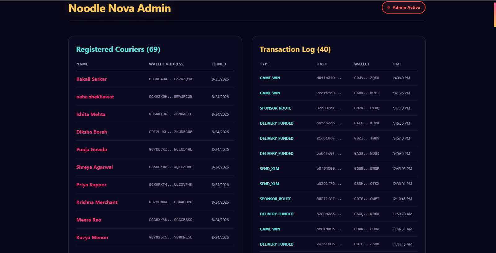

# Noodle Nova

Noodle Nova is a **Stellar Testnet dApp** built around a gamified ramen-delivery experience. Users can connect a Freighter wallet, view Testnet XLM balance and recent activity, send Testnet XLM, and interact with a Soroban delivery-escrow contract that locks funds until a sponsored delivery is completed.

> **Testnet only:** Do not use real funds or production credentials.

## Links

| Resource | Link |
| --- | --- |
| Live demo | [noodle-nova-seven.vercel.app](https://noodle-nova-seven.vercel.app/) |
| Demo video | https://drive.google.com/file/d/1N6QC__iKYQbef9ZXsaxMIjnC2TDsDUwN/view?usp=drive_link |
| Public repository | [SujAnverse1125/NoodleNova](https://github.com/SujAnverse1125/NoodleNova) |

## Product Evidence

The following assets are already present in this repository and document the existing product and development state. They are referenced here without changing the application or deployment.

### Product UI


### User feedback system


### Mobile responsive UI


### CI/CD pipeline


### Test output


## Core Features

Noodle Nova currently documents the following product capabilities:

- Freighter wallet connection.
- Stellar Testnet XLM balance and recent transaction feed.
- XLM payment form with validation, loading states, and error states.
- Responsive Next.js interface.
- Soroban `DeliveryEscrow` contract with create, complete, and read operations.
- Token-contract transfers and `DeliveryCreated` / `DeliveryCompleted` events.
- Rust unit tests covering the delivery flow and invalid repeat operations.

## User Journey

A user opens the deployed application, connects a Freighter wallet, reviews the available Testnet XLM information, and uses the ramen-delivery flow to create or complete a sponsored delivery. The application displays transaction progress through its existing interface. Users can also access the feedback experience to submit a rating and written review.

This README describes the current deployed product as documented by the repository. It does not claim that new application features, new smart-contract deployments, analytics configuration, or monitoring configuration were added during the documentation update.

## Architecture


The architecture diagram above is **NoodleNova-specific** and is based on the actual repository paths. A player connects a Freighter wallet to the Next.js frontend. The frontend uses Stellar Horizon for Testnet balance, activity, and XLM transfers; calls the existing Next.js route handlers for users, rewards, transactions, feedback, and user statistics; persists application records through Prisma to PostgreSQL; and interacts with the Soroban `DeliveryEscrow` contract. The contract emits the documented delivery events. This is a documentation diagram only; no application architecture was changed.

| Layer | Current implementation documented by the repository |
| --- | --- |
| Frontend | Next.js 14, React, TypeScript, and Tailwind CSS |
| Wallet and payments | `@stellar/freighter-api` and `@stellar/stellar-sdk` |
| Smart contract | Rust with Soroban SDK `27.0.6` |
| Contract domain | Delivery escrow with create, complete, and read operations |
| CI | Existing GitHub Actions workflow for frontend build and contract tests |
| Deployment | Existing Vercel deployment linked above |

The contract uses Stellar's native asset contract through `token::Client` to transfer funds from the sponsor to escrow and from escrow to the courier after completion.

## Stellar Testnet Contract and Proof

The following values are documented by the existing repository. Stellar Testnet state can reset, so reviewers should open the public links during review rather than relying only on static README text.

| Item | Value |
| --- | --- |
| Network | Stellar Testnet |
| DeliveryEscrow contract | [`CC42H6ONIV2527FPJZFTWV7UZNMWCEZDKZZNCNVF3ZN4ZWTXPIUKSBCM`](https://lab.stellar.org/r/testnet/contract/CC42H6ONIV2527FPJZFTWV7UZNMWCEZDKZZNCNVF3ZN4ZWTXPIUKSBCM) |
| Native XLM asset contract | `CDLZFC3SYJYDZT7K67VZ75HPJVIEUVNIXF47ZG2FB2RMQQVU2HHGCYSC` |
| Contract WASM hash | `ee3892dbe6df123ee75180a44674bf55040c422372f8684ea90f107d6548c1cb` |
| Deployment transaction | [`c4ba73be851893fca97e42b724e3ce1cc1a8aba200748b0436eaea64e395dad6`](https://stellar.expert/explorer/testnet/tx/c4ba73be851893fca97e42b724e3ce1cc1a8aba200748b0436eaea64e395dad6) |
| Create-delivery transaction | [`ed214acb9282d0ed596e5ed55f710170a68d83fcd657fd52e81f370e23083470`](https://stellar.expert/explorer/testnet/tx/ed214acb9282d0ed596e5ed55f710170a68d83fcd657fd52e81f370e23083470) |
| Complete-delivery transaction | [`93e6df19413a77b2fa0b1041bb7edbb194e3e22cb244911989a078a3236f9ee5`](https://stellar.expert/explorer/testnet/tx/93e6df19413a77b2fa0b1041bb7edbb194e3e22cb244911989a078a3236f9ee5) |

The repository describes the documented Testnet flow as creating delivery `1`, locking 1 XLM in escrow, emitting `DeliveryCreated`, completing the delivery, releasing 1 XLM to the courier, and emitting `DeliveryCompleted`.

### Contract interface

```text
create_delivery(delivery_id, sponsor, courier, token, amount)
complete_delivery(delivery_id)
get_delivery(delivery_id)
```

`create_delivery` requires sponsor authorization and transfers the requested token amount into the contract. `complete_delivery` requires the stored sponsor's authorization and releases the escrowed funds to the courier.

## Local Setup

### Prerequisites

Use Node.js 20 or newer, Rust, and the Stellar CLI.

```bash
git clone https://github.com/SujAnverse1125/NoodleNova.git
cd NoodleNova
npm install
npm run dev
```

Open `http://localhost:3000`.

To override the default Horizon endpoint, create `.env.local` with a non-secret public Testnet endpoint:

```env
NEXT_PUBLIC_HORIZON_URL=https://horizon-testnet.stellar.org
```

Do not commit private keys, admin tokens, API keys, or other deployment secrets.

## Test and Build

```bash
# Frontend production build
npm run build

# Frontend tests
npm test
```

The existing README records **3 passed, 0 failed** for the documented frontend test run. This result is preserved as repository evidence and has not been regenerated or altered as part of the documentation-only update.

The GitHub Actions check currently shows a red status because recursive `node --test` discovery encounters broken tracked `.claude/skills` links on the hosted runner. This is a pre-existing CI/test-discovery issue unrelated to the documentation or image updates; see [`submission/ci-status-diagnosis.md`](submission/ci-status-diagnosis.md) for the verified details.

## Users Onboarded and Feedback Evidence

The complete current response data from the owner-provided [Noodle Nova Feedback Form response sheet](https://docs.google.com/spreadsheets/d/1i4tkHd1MR0qPSeLngOxr9hNsqelM31TxBhXPZilFecI/edit?usp=sharing) is presented below as one continuous GitHub Markdown pipe table.

|  Timestamp  |  Full Name  |  Wallet Address  |  Transaction Hash  |  Rating  |  Review / Suggestions  |
| --- | --- | --- | --- | ---: | --- |
|  16/08/2026 22:46:13  |  Ishita Mehta  |  GD5VMIJR247PGGHES76I4PXP73G7UTXZRYH6BXI3YF5G5HCKJ6NR4ELL  |  -  |  5  |  its really awesome  |
|  16/08/2026 22:46:38  |  Pooja Gowda  |  GC7DECKZ6GEOI3XGGZG5D3NZIOYRLNP77J7LEALDPIPWHU6DNCLND4RL  |  -  |  5  |  wow  |
|  17/08/2026 13:19:54  |  Shreya Agarwal  |  GB5CRKDHZ2PCZKTTH3HPKAPIKUBIPAAEW66A3YSTZZFQM53J4QEGZUMG  |  -  |  3  |  not so helpful for non techies  |
|  17/08/2026 20:27:56  |  Priya Kapoor  |  GCXHPXT45FE3O55RZTECBQQ3IWOUHQOU3GHNIGGU3Q7CKUX7ULIXVP4K  |  -  |  4  |  good ui  |
|  17/08/2026 21:46:57  |  Krishna Merchant  |  GD7QFNWWBHYJKBKFIRHJIFSFZRH2BCAZ7LIVZHG6AEZ4GURLUD44HOPO  |  -  |  3  |  need improvement  |
|  18/08/2026 12:52:57  |  Meera Rao  |  GCCBXKAU2BZX5CHBDW3TPR3NYX7BAZPDIZFVAOVYQGTKMNXVGGCGFSKC  |  -  |  2  |  not good  |
|  18/08/2026 13:16:51  |  Kavya Menon  |  GCYX25F52SFDKGY7WSAE7SLATKN25ZKCYYAQ4I4JGW7BIKTHYSM6NL5E  |  -  |  4  |  really useful if it spreads more  |
|  18/08/2026 13:17:59  |  Sneha Iyer  |  GBVNXXTGFSF3ZK6QF5EHWU6NKY7Z7DIZTRRPL4OVKFQRKSHCOD57QFXF  |  -  |  5  |  nice work  |
|  18/08/2026 15:17:52  |  Tathagata Guha  |  GAV4OONA2FR27GKZXDD3SNVPYH44MQN5GTGFWUCS24CBEIDNCYA3W2FI  |  -  |  4  |  you should add more like freighter  |
|  18/08/2026 16:17:51  |  Ananya Hegde  |  GD7MXNTHHCPXFFKTHCZPKIRILUUVJZF5EPDTXD4Z2732ACNI7QW4RIBQ  |  -  |  4  |  the app looks good  |
|  18/08/2026 16:25:01  |  Srinwanti Kar  |  GALGGCLBTNDTM2FMPMZI2FTPKWI4SUAZKIFZUDLR24NRTXYHBQIPKCPK  |  22ef4fe9f86902439fafca21358aba08074ebdcfe1956267e029b0d2dfa6272a  |  5  |  great and awesome specially the landing page  |
|  18/08/2026 17:30:33  |  Nilanjan Majumdar  |  GDZICGWBWRD2YPYWQ4KEMK5KTOLDDXDI7VCGXFMSNB6HFUKKBYGWTMDS  |  87d9076148d94c8369bfa42e6121d374972430b0c845b294cfde2d12f6858ec5  |  5  |  nice work  |
|  18/08/2026 18:54:32  |  Rintaro  |  GASWJJS6ZGUTW3U2PF66DXSKE7UETIWH4LDGBWOK7ZMGNAMK5SUVNQ23  |  abfcb3cb798ad605cc50cb09ecc3e65e147685f289fa72f7c0c7ec9b99c94b76  |  4  |  good  |
|  18/08/2026 20:06:28  |  Kakali Sarkar  |  GDJVC4R42U5AT4BJXG3NQZ3Q6CWJUEVV4PTNE5Y7M6NYPX3BS37KZQSW  |  21c6163e6fdd998d882cf5088c7e4475cfb6cdd873e88d092877910124c296c9  |  4  |  good  |
|  18/08/2026 22:13:03  |  Koushik Bhattacharya  |  GDGMPZCD6ANI2UO4QPXK7OEWB7O6DVOCKZRZCCITI7E3PS2VH452BWSP  |  5a64fd0fb51d26c005f67e0c68902cd0ba9745929629129c66d449580115468b  |  5  |  very good website  |
|  18/08/2026 23:05:03  |  raghuveer reddy  |  GBNHJYJJVL63GZ7IW7JBG75S5KVX5RIEC4L4XXFPCAUPYTCRX7GIOTKX  |  d64fc3f999c3d6b7654f1f51aa46f01f793bb1b020d4a3a41c70cb0c4a8d1793  |  2  |  not satisfied needs improvement  |
|  19/08/2026 08:05:02  |  Modhu  |  GDI6BXPHUQFXURCUMQORUTWOYTMWJ5RVDVTSHCS3632ZBZ5BCCMMOMFT  |  b8f345094e6f69db635ab61caf070b30424682f67af710f66c41d3d780f5c5f1  |  5  |  nice nice nice  |
|  19/08/2026 13:06:47  |  Agnibha Roy  |  GAGQJDUFT7BYB4WJKJTDEUDXTVGHV6Z2ZKDSJGIMN75757BXGFAPNDDW  |  a0361f765ca2876c3bdd2d98e25ca39a37df7e134cb745c97c0b14fdf5b60c82  |  4  |  good work  |
|  22/08/2026 12:39:05  |  Harshvardhan  |  GCAKX6MKRC34JN6YP653XJPGFERMQZUM3YIFPFHYJC5FU4OD2XHCPHRJ  |  662f1f2761edc255b768e9a1f3d60afb041289ae507712f1528609db3f929e1e  |  5  |  its really nice  |
|  23/08/2026 13:22:15  |  Arundhati Bhowmick  |  GDTCQRZ3MKLZIKCMDKQSEUNZI2BEO25K2PVCP5XICIBAEDH4F4OOJ6QM  |  8729a3838a013e6b4f97dfab0579d548c3200f467119ddd9fe37be2aa7de33eb  |  5  |  khub daarun  |
|  23/08/2026 13:39:25  |  Prosenjit Dutta  |  GCTDDLUMBDOSFCMGVH3W7Y3OBB3FEUI4UIMDD4YISC4HIX4GZPPW3YBC  |  6e21a426f22739b10999940ecca7b4cf67661e2fd9255f7e27086fc317e3dc69  |  4  |  the website looks cool  |
|  23/08/2026 13:42:32  |  Tenzing Norbu  |  GCAFCCR7NQJA7V546XDX5DFAZ5GSU6QEN6BITPQ2O76XFQVUJZZQKI5S  |  737b1905e9e85452503ce838445ce5f08bb11f12657b770b9e4c48d6af59266f  |  3  |  albedo is having some issues  |
|  23/08/2026 14:29:55  |  Priyanka Chaudhuri  |  GDOFIIWPEN6NLAB2YJY3XOKNWMX7GIVO76GNHHOEEAPOPDPDDYNBNASU  |  0b967b01e8fdaad84711ac0275ac2aa9a3f5d34fa0265706a5ab5faae391113a  |  4  |  good website  |
|  23/08/2026 14:31:07  |  tanmoy Bosu  |  GAOJHVLA2UQMGMENRHH44P4U6NAEUPPZ2WYQKJ3NZCXDDXTTDFG35JNH  |  bfe2c1c899c0fa3f87d10131de2eaf4812f074d7fd37ade11c8c330fe38198ff  |  4  |  nice  |
|  23/08/2026 14:34:18  |  Varun Joshi  |  GB56VCMQT77RWTGNMQO6LBZ6SLKWFKXME5WYNKXWOVK66IM7AVBPNH2D  |  0e0224afa2c02ddf2d95e699c137f73d65df6022843da65c009d1631961383ae  |  3  |  could be more better though  |
|  23/08/2026 14:40:30  |  Suparna Nandi  |  GD7SJQORGGMS3L4LHOWV4CKAHVXRSZUYRV6NMXWLNP3QNLFIBPDPE5PJ  |  24e81690cd90e56ca0ae144420a0891ef917952f11bd1b1eecdab14581d01998  |  5  |  nice ui and design  |
|  23/08/2026 14:41:10  |  Indranil sen  |  GBHFTOQVLUG4AGRHSP5CPWU55TY7TOCILCDFICJTQVENYBBSJB56HQ5T  |  ce4856e7546990d4e8be5942a98cafe59996e7a77cb6f9fd16ddcbe7825a47e7  |  3  |  i tried it tbh it is still not production grade  |
|  23/08/2026 14:41:42  |  Pradeep Sharma  |  GBEPUQGJA6JHNWIRLEUULGY5OC4YTJDQUVLT5IJF6VASLBRLJH5632QK  |  a3edbafe531c7b0e9c76a68af9cd31d6c54f7ef62d87900badfb2c8ba457391c  |  5  |  the idea is really amazing and innovative  |
|  23/08/2026 14:42:50  |  Jhumpa Biswas  |  GDKQTZAMJCQBPDPH6BGXWGKRMPL3ZLSBBJVKOPR547SNKRNH23V5SVSU  |  386b31fb1e765e58fac6c8efbccdb35732b20c94fa6efe53e34ad4a836c2e6aa  |  5  |  great job brother  |
|  23/08/2026 14:44:00  |  Aritra das  |  GACIXSJ46473TMPJNBXD7HEINX2VAT63LQBE5QYC7Y5JFJWAZARAG7W2  |  dba307ea46739fdaabe398d2d5ed291a8aaf523e9bc9c386811182ce397d7975  |  5  |  nice ui  |
|  23/08/2026 15:20:20  |  Kunal Deshmukh  |  GAX66KG6Q7DSTAGLR6CVOX7SYX5DIMSNKIED4W45B3BLZJHU6NWWIFWI  |  465197dca6f96078c6f89d4e734fbc8c2bc6a634336c74442310ab520a43f26b  |  4  |  good  |
|  23/08/2026 15:20:39  |  Suchismita Pal  |  GCBIQMO3REVQADHJU33MB3XR6MUSIEFBRAS366OVOZP7GCYQNADFYBC4  |  25004a78cbe2bac472740548ffe6d54eef82c208a3bfe574c112a81a570374b9  |  5  |  done bro good work  |
|  23/08/2026 15:21:41  |  Ritwik Ghosh  |  GAE6BRA5FIJT2LFZ3CCWFOKSGXFZJ6JEITZDQCNSC7RUUJRT6M26WDWN  |  474e72af216abe3395f232167b312b63ceb4f3fd760fad2f2e9de84481a47301  |  5  |  dekh bhai transaction o korlam  |
|  23/08/2026 15:30:50  |  siddharth nair  |  GCGRMP4WDOJBAFULBH4QLDV7M7MCLAJQK3UUUE7XKCZIUAXDFCSCA7ZS  |  bd3e32c7f371670eb1d55bcb55c8f7f187a62f82bcdac299a3301eade47966d8  |  4  |  its been so long since u made something good  |
|  23/08/2026 19:22:00  |  sreelekha ghoshal  |  GCAXARZO2FBLTSMSQXAWIJOCGG7FRVWBNXSGJ3IUSPVWJITTOY6XIASQ  |  f9614cbc1713d70cf9af2d9a6338478751466661d30be60d2c94da9e8c629a0e  |  5  |  the ui is amazing  |
|  23/08/2026 19:40:10  |  Subhashis Ray  |  GCEZ6KUXIHFTTAW6IJYLE4NXC33R5OCCBHUFZCY3SXFBEMHHFK3PUE36  |  4e75024e0880fd4d279737a11a36657163c75141a72414eb34930717b4eb5ccc  |  5  |  great  |
|  23/08/2026 19:41:59  |  Arvind Swaminathan  |  GBOTQIBQNALA477UGNHFS5P556RBR7GWRKIGO5HDVTATBYTUFE5ULYUC  |  d9c0c22ee1ce1a6abe8188ec551aa3912b4ea66fb5ab330dc417b9e37e3d362e  |  3  |  ai is a bit slow  |
|  23/08/2026 19:42:30  |  Deboleena Mitra  |  GCIP56RVQO32UXIY36FZPFECYZPAJOBXEPIKY4GEXCZC3TAPP6XQ6CPL  |  8942bbafc3203a60e4492a85d18702f52a1ae3a00b7a7ef58f75be07ada9288b  |  4  |  great job but the syncing is taking time  |
|  23/08/2026 19:42:48  |  Sayan Ganguly  |  GB6CLWWEWKGR5W4HW427T6OTZQS6MVJBF332GUKVR6YS5L6YU7IVG4RJ  |  187e5b5b1ccfed99388f9335879b5c7a96a22fc064dbdcd3a17fd89afed9b40e  |  5  |  amazing work  |
|  23/08/2026 19:42:55  |  Rohan Kulkarni  |  GCX7RT3RNOJ4SIYVPALPXKJFSTWOOGWXCPSM7E4VLSD6AITB3BOXUMPI  |  d083e3c2f12a2526b1ea71c8b7944dcbe44842c3ea6b444396610316d45b8ea6  |  4  |  mumbai kab aaoge bade bhai  |
|  23/08/2026 21:48:24  |  Paramita Roy  |  GBEZOCC7WBZN7A63Y6CMMFEWIXO36Q35FI4O3PCPIWYSRMZH5C4LXC74  |  152266186c16e9954a0bbeebc5cca8b62944a72203c06f41312b9be91e0d2a8d  |  4  |  good  |
|  23/08/2026 22:00:58  |  Soumyajit Mukherjee  |  GBO3F5XHMASTIOZJR4VMLJVY5QKXKWQPVE6RMO3WOZLNCVJINAOSWYDG  |  c29dd434f97d3236df21031e9ffcfcc626b350125cf469b7826bfe0e22116faa  |  5  |  the ai got guardrails i think nice work  |
|  23/08/2026 22:05:10  |  Aditya Varma  |  GBAEZMTWFG3PMMTVGVF24VMAUMNBCF2JQC6MLAKF3O6RICNFPM3JUND2  |  1ea1b924c299d928dc0eba289ce3d7689ac3a98e7b6d1a50564a14690973be29  |  5  |  It is very good and is quite fast  |
|  23/08/2026 22:40:01  |  Lopamudra Sengupta  |  GCJPBUOKWUI3NLBEYMU2YV2VM7BAC5ZDNPZNUTYYDXUN6DKFZZSMNK23  |  e52b2b228a774264af7856e0d5721ce76ac87748c3e65a9629d32d9c013a4fb8  |  5  |  baah daarun  |
|  23/08/2026 22:43:55  |  Debabrata Banerjee  |  GAQDZOG6EWIWWPYSE6KZ4KFS4I5P6CRRGHBM7ZMPYJLKOMSMP2T6QFJ2  |  7446eb723352f448cda8fa3b660ae2b8b800b2b5001afe58df653c1eeed48fae  |  5  |  ui is clean  |
|  24/08/2026 11:44:05  |  Vikramaditya Rathore  |  GAEW6JOC64EP3QZWZDNR32SFVZTRX7FGXEG2L5FAUS3IED4ON6FK3C4S  |  e3321be37ed98ded62c73b3ee28e8aadbadb08e1d17a2d9325390bb2a35c91d4  |  4  |  good  |
|  24/08/2026 11:44:15  |  Swastika Chatterjee  |  GB5YELQUQHJQHSGQP4FD6DC6YTGBT4LF7DHXAHU6GCAHKU4MAX2GOZPT  |  b243db6beb055bdf5aa6b15d9266290b69bbfa1a4ead782e71270164c0f275a0  |  4  |  looks good but need more companies  |
|  24/08/2026 11:46:31  |  Anirban Chakraborty  |  GAFA2O72V23LV7WMTT774EHLBGLV7ETLOSG63TLJ6RWZT7FGUV4TM7ZZ  |  4adf15f098008f07d36bee4190f1cdbaa674efb7c44694c0d764bf48724651d0  |  5  |  bhai tui to kore cholechish. keep it up  |
|  24/08/2026 11:59:20  |  ankita barman  |  GCV5X5CKYUAPQLE3OYQS3PDXKX4TRV767YUCJ66PWWGZD2BXE744T276  |  cd568412107aa05870cfa767d6d7ee1c1c980e48036c18045862512199c78bc3  |  4  |  Good  |
|  24/08/2026 12:10:45  |  Sandipan Singh  |  GDYIHXTUKLCPZHWGGD5B5ZPJZINZ3WUNC3PJCDAYEB4XY4LT2XNTQHTX  |  845f3cbac42942212070c3a8c15f5f3ebc667a5f7c55df78634dfb95f7bf6f7c  |  4  |  Its pretty good, keep it up scale it  |
|  24/08/2026 12:30:01  |  Aditya Jha  |  GAG3SUKHIF7VAWGTDRH52XETMLZXXNXBAZLLXHSLXAQPOBBCN43YLKR4  |  -  |  4  |  I like the product its nice. But needed more work on UI.  |
|  24/08/2026 12:45:05  |  Arya Bhagat  |  GCNZDOHRGJLUKX53TR5PETCO7Q3BKKWVS5K5GQ3NPFZYQ4MKY2BK6A32  |  -  |  4  |  its a good project to start with  |
|  24/08/2026 19:45:35  |  Subhadip Dutta  |  GAVNLCS3GSWLKXSLZ3ITSL7QNB5IGHEOELXAF6QTYACDLEJ7XRQKBBNO  |  -  |  5  |  Very nice ui and the idea is quite innovative  |
|  24/08/2026 19:45:40  |  Ankush Shaw  |  GBBIG4HLPGTLG6BH6YREVWJXEQ4NX74HTD444JD6A6XYS7DOFL2J6DEI  |  -  |  5  |  the main feature i liked was ui, how clean it looks  |
|  24/08/2026 19:46:56  |  Sadiya Mulani  |  GBTCGV43NLHEEBMCA5DWFZT6GOJYYCPHXNOEALTBQ7TREIQKQQAVLYT4  |  -  |  5  |  Cool concept. AI-verified, wallet-owned credentials  |
|  24/08/2026 19:47:10  |  Nitin Raj  |  GARRE4DTEUJIQSXRACCL6X55RH42S7WBO32F5HB4DU32MT6IL5TL3B3N  |  -  |  5  |  Great experience! Clean UI, easy to use  |
|  24/08/2026 19:47:26  |  Rishikesh Singh  |  GCO222KICSTS24BWPBEOSYQG5L3RAN4KHII7CE2CW36HRHRXQQPC6OCB  |  -  |  5  |  I really like the ui and credential hashing  |
|  24/08/2026 19:48:36  |  Elijah Negasi  |  GAXCXDDP44VRDTL2PJI22WJU6H4CMRMI2CHRJGPJ3S3L4R323ETDOCAL  |  -  |  5  |  amazing!  |
|  24/08/2026 21:00:20  |  Ritam Saha  |  GACMLTEWZ23NGJ5WZ2THYGLODFYTEKECB7J2U33H3DCSW2PEAQUEIZED  |  -  |  4  |  Good  |
|  24/08/2026 21:02:56  |  Priyanka Mondal  |  GCKMODNZEAI4X6AL6SL77PNJLUUJAQAWECXDTXJZGXBOSSSF7THC3XH6  |  -  |  5  |  better product than other in market  |
|  24/08/2026 21:18:06  |  Ritesh Gupta  |  GDFSDPEEBZYQVG5JPPTJUOH4FID4M5XV45BKTWCIEIRYMCWJ6DQADBMB  |  -  |  4  |  yup  |
|  24/08/2026 21:30:16  |  Sk Jishan Uddin  |  GAVVOOVYGE7QEJWQO2BZZBGYYSFQPBC3QAYWRC6AFP7E3UMCWFT6YC4U  |  -  |  5  |  Very Very Good, very user friendly  |
|  24/08/2026 21:45:57  |  Lohit Mishra  |  GDYWYDOBPPM2XFQS2N7OA2XYO66C24OSBDGASSYAU7V3V4UHFIQYWCRL  |  -  |  3  |  Ui is great but server errors occurring  |
|  24/08/2026 21:47:36  |  pritam dev  |  GATJMD6BGNK4FQYNFWB354N7RP4XHA2R74GNSYM472ALNLJFX7NXBS3X  |  -  |  5  |  awesome product  |
|  24/08/2026 22:41:16  |  Ansh Raj  |  GA3EHDIPTPLQTQESCNR4TSJYBSERD57KERCNFHGWEJ5OX2XSWTMJO424  |  -  |  4  |  its really good  |
|  24/08/2026 22:41:20  |  Amitabh Dey  |  GBKYHWSL2MNUO73HWY6KWNOA64AKSUENCOBTR56M66HNLMMKMZHK5OAS  |  -  |  5  |  really good ui and interactive game  |
|  24/08/2026 22:43:12  |  Neel Madhav  |  GBO7BZSNAX6APJW32OE5LHXQZ6MTIHBTWRZZRCJL3VSILWCAZLGCPM4T  |  -  |  4  |  The gameplay is good but needs improvement  |
|  24/08/2026 22:45:07  |  Harsh Mitra  |  GDHYPRZCSOHMGPVM3XETQL3AXUBVLPCLUR4LSYW4QOC7AKR5MWGXAEND  |  -  |  5  |  very good  |
|  24/08/2026 22:47:51  |  Debansh Tiwari  |  GA4SXARZZ4RPF6N7VOAH3B5OKMFAP3FGY6M6TO3DZJL4TMU2KOVBHCIY  |  -  |  4  |  The overall experience is smooth. Liked the product!  |
|  24/08/2026 22:50:01  |  Syed Ghufran Hassan  |  GDNKF4Q474WVV5CCRLKIM53HCKRB7AN5O7DVD6GYYAEGXZEBD2KVB723  |  -  |  5  |  If we can have a roadmap for basic understanding then it would be great for beginners  |
|  24/08/2026 22:51:01  |  harshit kumar  |  GB3OASNQ4B3DBZBXXT4UW3WXGQRMUBHXK3WAVH2VOWUHR6BUWHFKTVKI  |  -  |  5  |  Everything is good, best one till now.  |
|  24/08/2026 22:57:49  |  Abhi mandal  |  GDD4VQG7DXQTQ4SM32Q5GMTYCJAKPRPDHUYRMRWBBW5SLOLOTPGEQXKF  |  -  |  4  |  overall good and best.  |
|  24/08/2026 22:59:41  |  Manish sharma  |  GC5D7MTHTTEINHVN3W6JCNROFRAI4ZXDMYI4GYTR5L46TKNWSJHDXYZ2  |  -  |  5  |  Good.  |
|  24/08/2026 23:01:25  |  Disha  |  GCFHMXPIVQPNUZGXQUQDAT656UBVEL6RCRDKMPJ3FCT73CODOKNJFMXF  |  -  |  5  |  one of the best till now i saw.  |
|  24/08/2026 23:05:04  |  Supriyo mandal  |  GABKZVXSUGV7P24X24EEF3LTNKZRSWBNT6D77DER7XVLVX77WKEID2XA  |  -  |  5  |  overall it is the among the best, after seeing others.  |
|  24/08/2026 23:12:15  |  SK JISHAN UDDIN  |  GAVVOOVYGE7QEJWQO2BZZBGYYSFQPBC3QAYWRC6AFP7E3UMCWFT6YC4U  |  `d5bd5b60c643767cb355fabde02a8426cdc2d4103bde2576251e20aeb3416103`  |  5  |  “Really impressive work, bro. Keep building! 🚀”  |
|  24/08/2026 23:12:55  |  RITESH GUPTA  |  GDFSDPEEBZYQVG5JPPTJUOH4FID4M5XV45BKTWCIEIRYMCWJ6DQADBMB  |  none  |  2  |  none baby  |
|  25/08/2026 02:00:54  |  riyam lahu  |  GATJMD6BGNK4FQYNFWB354N7RP4XHA2R74GNSYM472ALNLJFX7NXBS3X  |  6bd2cc147f99f17e373c6ce507176611700b9a63ca46a2c4c8b70f847d5d0bf7  |  4  |  good nice  |
|  25/08/2026 10:41:47  |  Shubham Raj  |  GAQW2UZBSRIQVW7YVS3GFYGMAJOXWQLTCTXXI3F7IZWQBTAAVENVFISW  |  -  |  4  |  great experience  |
|  25/08/2026 13:40:40  |  Debansh Tiwari  |  GA4SXARZZ4RPF6N7VOAH3B5OKMFAP3FGY6M6TO3DZJL4TMU2KOVBHCIY  |  -  |  4  |  The overall experience is smooth. Liked the product!  |
### Admin-panel interaction evidence

The following screenshot shows the NoodleNova admin panel with the registered-courier list and transaction log used as operational onboarding evidence.



Because both screenshots contain names, wallet-address fragments, transaction identifiers, and other user-related fields, they should be treated as sensitive submission evidence and not redistributed beyond the authorized review process. The analysis in [`submission/feedback-summary.md`](submission/feedback-summary.md) intentionally reports aggregate results instead of reproducing the raw rows.

## Feedback Summary

The current shared sheet contains **80 responses**, all with a wallet-address field and written feedback. Ratings average **4.34/5**, with the following distribution: **40 five-star**, **30 four-star**, **7 three-star**, and **3 two-star** responses. The sheet contains **42 non-placeholder transaction-hash values**; these values are evidence candidates only and are not independently verified here as successful Stellar transactions. The responses span **16–25 August 2026**. Feedback is predominantly positive about the interface and overall experience, while gameplay refinement remains the clearest improvement theme.

The table above is the complete current-sheet row-level evidence. The separate [`submission/user-onboarding-table.md`](submission/user-onboarding-table.md) remains available as the privacy-safe public version with masked emails and shortened identifiers.
* **User Experience:** Players consistently describe the interface as visually appealing, engaging, and among the best they have encountered.
 * **Gameplay Development:** While the current gameplay is viewed positively, feedback indicates that it still requires further refinement and improvement.

## Admin and Privacy Note

The authorized admin panel was reviewed as a private operational evidence source. Its access token is intentionally not linked, copied, or published here. The public submission package uses only sanitized counts and verification status. Any final reviewer package that needs full wallet addresses or transaction hashes should be shared through the appropriate private submission channel, not committed to a public repository unless those records have been explicitly consented for publication.

## Testnet Note

Stellar Testnet resets periodically. A reset can remove Testnet accounts, transaction history, and contract data; redeploy and generate new proof transactions if a reset occurs before review.

## References

[1]: https://github.com/SujAnverse1125/NoodleNova "NoodleNova public repository" 
[2]: https://noodle-nova-seven.vercel.app/ "Noodle Nova live deployment"
[2]: https://lab.stellar.org/r/testnet/contract/CC42H6ONIV2527FPJZFTWV7UZNMWCEZDKZZNCNVF3ZN4ZWTXPIUKSBCM "Noodle Nova DeliveryEscrow contract on Stellar Lab Testnet"
[4]: https://stellar.expert/explorer/testnet/tx/c4ba73be851893fca97e42b724e3ce1cc1a8aba200748b0436eaea64e395dad6 "Noodle Nova deployment transaction on Stellar Expert Testnet"
[5]: https://drive.google.com/file/d/1N6QC__iKYQbef9ZXsaxMIjnC2TDsDUWn/view?usp=drive_link "Noodle Nova demo video"
