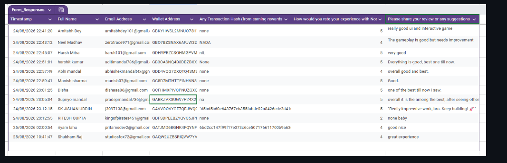

# Noodle Nova — User Feedback Summary

## Evidence source

This summary is based on the current owner-provided [Noodle Nova Feedback Form response sheet](https://docs.google.com/spreadsheets/d/1i4tkHd1MR0qPSeLngOxr9hNsqelM31TxBhXPZilFecI/edit?usp=sharing). The sheet contains **80 response rows** dated 16–25 August 2026. The spreadsheet image below is retained as a visual layout snapshot; this Markdown file intentionally contains only aggregate analysis and does not reproduce the raw spreadsheet rows.

## Rating snapshot

| Metric | Observed value |
| --- | ---: |
| Current responses | 80 |
| Average rating | 4.34 / 5 |
| Five-star ratings | 40 |
| Four-star ratings | 30 |
| Three-star ratings | 7 |
| Two-star ratings | 3 |
| One-star ratings | 0 |
| Wallet-address fields populated | 80 |
| Non-placeholder transaction-hash values | 42 |

The average is calculated from all 80 current sheet ratings: 40 five-star, 30 four-star, 7 three-star, and 3 two-star responses, for a total rating sum of 347 and an average of 4.3375, rounded to **4.34/5**.

## Qualitative themes

| Theme | Evidence observed | Product interpretation |
| --- | --- | --- |
| Interface and interactivity | Multiple respondents described the UI as good, very good, impressive, or interactive. | The current visual presentation is a clear strength of the MVP. |
| Overall experience | Several respondents described the experience as good, great, or among the best they had seen. | The core concept is understandable and engaging for first-time users. |
| Gameplay refinement | One respondent specifically noted that gameplay needs improvement; another described the work as good while still leaving room for improvement. | Gameplay depth, balance, and polish are the main feedback opportunity. |
| Low-detail responses | Some responses were short, such as “Good,” “good nice,” or “none baby.” | These confirm basic sentiment but provide limited actionable detail. |

## Privacy handling

The response sheet and spreadsheet image contain names, email addresses, wallet addresses, and transaction-related fields. They should be treated as sensitive evidence and not redistributed beyond the authorized review process. The Markdown file does not reproduce those raw rows. Full records should be shared only through the authorized review channel and only where the respondents’ consent and the submission rules permit it.

## Evidence limitation

The current sheet contains 42 non-placeholder transaction-hash values and 80 populated wallet-address fields. These values support the **user feedback and onboarding-response count**, but they do not independently prove 10 completed Stellar wallet interactions until the candidate hashes are verified on Stellar Testnet and reconciled with the admin-panel records. That requirement is tracked separately in [`interaction-evidence.md`](interaction-evidence.md).

## References

[1]: https://github.com/SujAnverse1125/NoodleNova "NoodleNova public repository"
[2]: https://github.com/AmitabhDey-byte/Cosmic-Capture "Cosmic-Capture reference repository"
