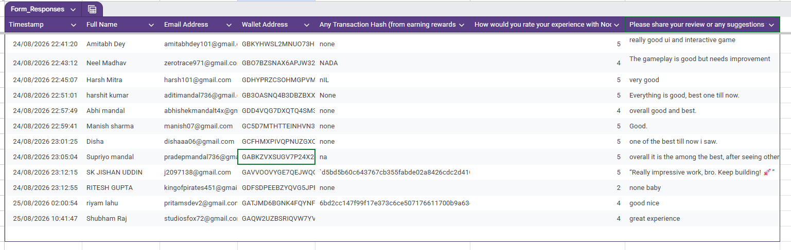

# Noodle Nova — User Feedback Summary

## Evidence source

This summary is based on the shared `Form_Responses` feedback-sheet screenshot provided for the NoodleNova Level 4 submission. It records **12 visible response rows** dated 24–25 August 2026. The original spreadsheet image is included below as the visual evidence source; this Markdown file intentionally contains only aggregate analysis and does not reproduce the raw spreadsheet rows.

## Rating snapshot

| Metric | Observed value |
| --- | ---: |
| Visible responses | 12 |
| Average rating | 4.42 / 5 approximately |
| Five-star ratings | 7 |
| Four-star ratings | 4 |
| Two-star ratings | 1 |
| One-, three-star ratings | 0 visible |

The average is calculated from the visible ratings `5, 4, 5, 5, 4, 5, 5, 5, 5, 2, 4, 4`, which sum to 53 across 12 responses.

## Qualitative themes

| Theme | Evidence observed | Product interpretation |
| --- | --- | --- |
| Interface and interactivity | Multiple respondents described the UI as good, very good, impressive, or interactive. | The current visual presentation is a clear strength of the MVP. |
| Overall experience | Several respondents described the experience as good, great, or among the best they had seen. | The core concept is understandable and engaging for first-time users. |
| Gameplay refinement | One respondent specifically noted that gameplay needs improvement; another described the work as good while still leaving room for improvement. | Gameplay depth, balance, and polish are the main feedback opportunity. |
| Low-detail responses | Some responses were short, such as “Good,” “good nice,” or “none baby.” | These confirm basic sentiment but provide limited actionable detail. |

## Privacy handling

The spreadsheet image was explicitly provided for this submission and is included as visual evidence. Because it visibly contains names, email addresses, and wallet-address fields, it should be treated as sensitive evidence and not redistributed beyond the authorized review process. The Markdown file does not reproduce those raw rows. Full records should be shared only through the authorized review channel and only where the respondents’ consent and the submission rules permit it.

## Evidence limitation

The screenshot shows a transaction-hash column, but several visible values are null-like (`none`, `NADA`, `nil`, or `na`) and some wallet/hash values are truncated by the screenshot. Therefore, the image and this document support the **user feedback and onboarding-response count**, but they do not independently prove 10 completed Stellar wallet interactions. That requirement is tracked separately in [`interaction-evidence.md`](interaction-evidence.md).

## References

[1]: https://github.com/SujAnverse1125/NoodleNova "NoodleNova public repository"
[2]: https://github.com/AmitabhDey-byte/Cosmic-Capture "Cosmic-Capture reference repository"
